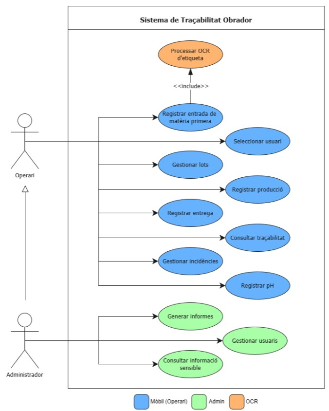
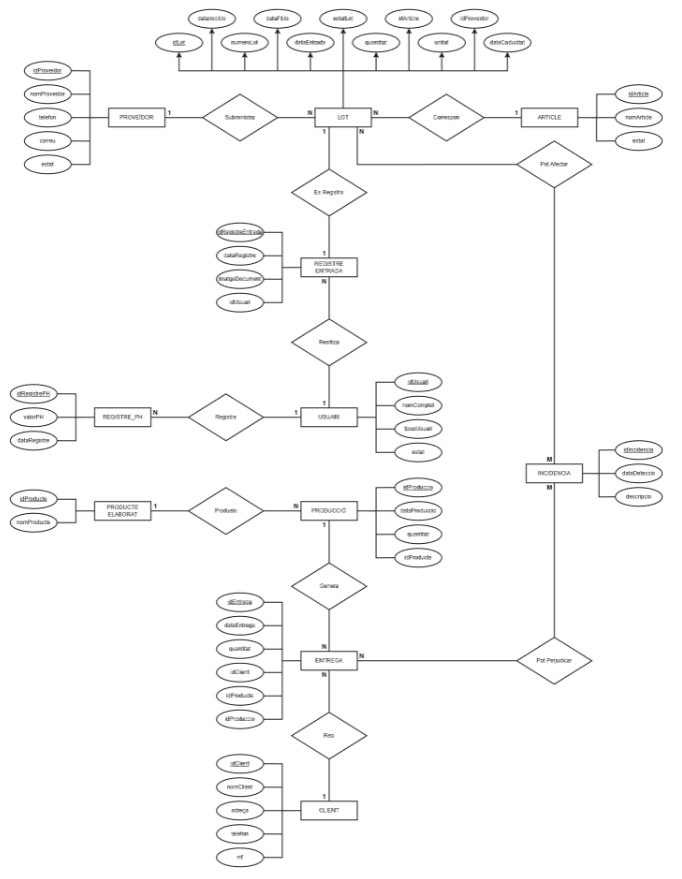
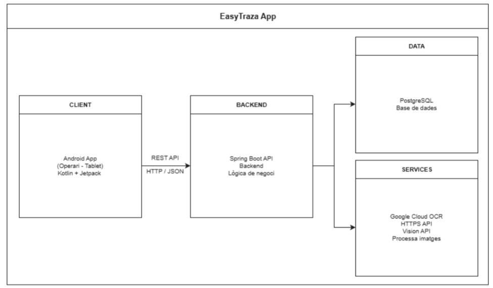
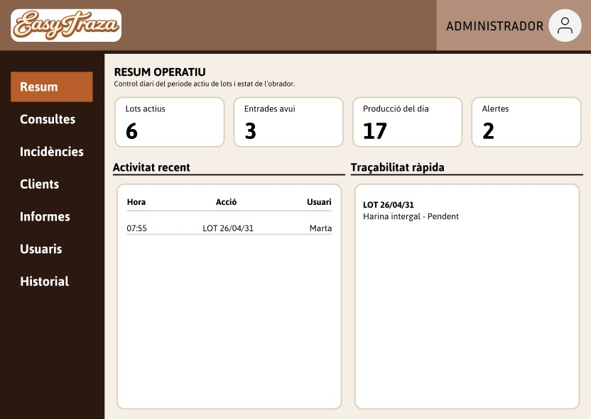
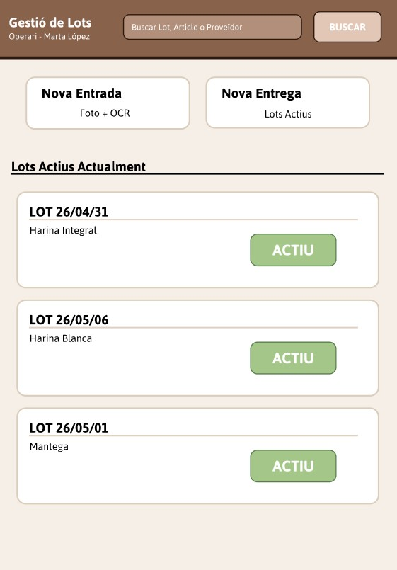

= Memòria de la Fase de Disseny - EasyTraza
Ángel Jurado Herruzo - 2DAMM - Institut Nicolau Copèrnic
:toc:
:toclevels: 3

== Introducció

Aquest document recull la fase de disseny inicial del projecte *EasyTraza*, desenvolupada a partir de la recollida de requisits i de les necessitats identificades per a l'obrador.

L'objectiu de la fase de disseny és definir una proposta estructurada del sistema abans de la implementació, concretant els actors principals, les funcionalitats que han de poder realitzar, el model de dades, l'arquitectura general i les primeres propostes d'interfície.

Els diagrames i mockups incorporats en aquest document corresponen a la proposta elaborada durant la fase de disseny del projecte. Per tant, reflecteixen la planificació inicial sobre la qual posteriorment s'ha desenvolupat l'aplicació.

== Diagrama de casos d'ús

En aquest sistema intervenen dos actors principals: l'*Operari*, que utilitza la tauleta o dispositiu Android per registrar les operacions quotidianes de l'obrador, i l'*Administrador*, que accedeix al sistema des d'un ordinador per gestionar usuaris, generar informes i consultar informació sensible.

L'actor Administrador hereta les funcionalitats de l'Operari, ja que també pot realitzar les operacions bàsiques del sistema.

Els casos d'ús representen les principals funcionalitats proposades per a l'aplicació:

- Seleccionar l'usuari que està utilitzant el sistema.
- Registrar l'entrada d'una matèria primera.
- Processar mitjançant OCR l'etiqueta o document associat a una entrada.
- Gestionar lots.
- Registrar producció.
- Registrar entregues.
- Consultar la traçabilitat.
- Gestionar incidències.
- Registrar controls de pH.
- Generar informes.
- Gestionar usuaris.
- Consultar informació sensible.

La lectura OCR es planteja com una funcionalitat inclosa dins del registre d'entrada de matèries primeres, amb l'objectiu d'agilitzar la introducció de dades procedents d'etiquetes o albarans.

== Disseny del model de dades

El diagrama entitat-relació representa l'estructura de dades plantejada durant la fase de disseny, mostrant les entitats principals del sistema, els seus atributs identificadors i les relacions necessàries per conservar la traçabilitat.

=== Entitats principals

[cols="1,4", options="header"]
|===
| Entitat | Finalitat dins del sistema

| Proveïdor
| Representa l'empresa o persona que subministra les matèries primeres a l'obrador.

| Article
| Representa una matèria primera o producte base associable a lots.

| Lot
| Identifica una recepció concreta d'una matèria primera i permet seguir-ne l'ús i l'estat.

| Registre d'entrada
| Emmagatzema l'entrada d'una matèria primera, la data, la imatge del document i l'usuari que la registra.

| Usuari
| Representa les persones que utilitzen el sistema, diferenciant les responsabilitats operatives i administratives.

| Registre de pH
| Permet conservar les dades dels controls de qualitat vinculats al pH de l'aigua.

| Producte elaborat
| Representa els productes finals produïts per l'obrador.

| Producció
| Registra la producció realitzada i la seva relació amb els productes elaborats.

| Entrega
| Registra el lliurament d'un producte a un client.

| Client
| Representa les dades del destinatari dels productes entregats.

| Incidència
| Registra problemes o afectacions que poden relacionar lots i entregues.
|===

=== Relacions plantejades

El model permet relacionar els proveïdors amb els lots subministrats i els articles corresponents. Els registres d'entrada queden vinculats a l'usuari que realitza l'operació i als lots registrats.

La producció i les entregues permeten reconstruir la traçabilitat entre els productes elaborats i els clients. Les incidències es plantegen per identificar els lots o entregues que poden veure's afectats quan existeix algun problema de qualitat o traçabilitat.

== Diagrama d'arquitectura

El diagrama d'arquitectura defineix la distribució inicial dels diferents components del sistema i la comunicació prevista entre ells.

La proposta de disseny diferencia els elements següents:

[cols="1,4", options="header"]
|===
| Component | Descripció

| Client Android
| Aplicació utilitzada per l'operari des d'una tauleta o dispositiu mòbil, desenvolupada amb Kotlin i Jetpack Compose.

| Backend
| API desenvolupada amb Spring Boot que centralitza la lògica de negoci i atén les peticions del client.

| Base de dades
| Sistema de persistència destinat a conservar usuaris, lots, entrades, produccions, entregues, clients i incidències.

| Servei OCR
| Servei plantejat per processar imatges o documents i facilitar l'extracció automàtica de dades.
|===

En el disseny inicial, el client Android es comunica amb el backend mitjançant una API REST amb intercanvi de dades en format JSON. El backend centralitza l'accés a la persistència i la comunicació amb el servei OCR.

== Disseny d'interfícies d'usuari i navegació

=== Mòdul PC - Administrador

Aquest mòdul està destinat principalment a l'administrador del sistema i permet consultar informació global del funcionament de l'obrador.

A la part superior es planteja una barra amb la identificació de l'usuari i el logotip de l'aplicació. A l'esquerra s'ubica un menú lateral amb les principals seccions del sistema, com ara consultes, incidències, clients, informes o gestió d'usuaris.

La zona central de la pantalla presenta un resum operatiu amb indicadors del sistema, com el nombre de lots actius, les entrades registrades durant el dia, la producció realitzada i les alertes detectades. També es plantegen blocs d'activitat recent i de consulta ràpida de traçabilitat.

=== Mòdul Tablet - Operari

Aquest mòdul està dissenyat per als treballadors de l'obrador que utilitzen una tauleta o dispositiu mòbil durant la jornada laboral.

La proposta d'interfície prioritza l'accés ràpid a les operacions quotidianes, com la recepció de matèries primeres, la gestió de lots actius, el registre de producció o el registre d'entregues.

El mockup planteja una interfície simplificada, amb botons grans i una presentació directa dels lots actius, de manera que l'operari pugui treballar amb comoditat mentre realitza les tasques habituals de l'obrador.

== Decisions principals de la fase de disseny

Durant la fase de disseny es van establir les decisions principals següents:

- Separar l'ús operatiu i l'ús administratiu mitjançant dos perfils d'usuari.
- Orientar el mòdul Mobile a les operacions quotidianes de l'operari.
- Reservar la gestió d'usuaris, els informes i la informació sensible al mòdul d'administració.
- Centralitzar la lògica de negoci i la persistència en un backend.
- Incorporar OCR per agilitzar el registre d'entrades de matèries primeres.
- Utilitzar els lots i els seus períodes d'ús com a element principal per reconstruir la traçabilitat.
- Dissenyar pantalles diferenciades segons el context d'ús: ordinador per a administració i tauleta per a operacions ràpides.

== Document de referència original

Aquesta memòria s'ha elaborat a partir del document original de recollida de requisits i disseny del projecte:

* link:Recollida%20De%20Requisits%20i%20Disseny.pdf[Recollida de Requisits i Disseny - PDF original]
