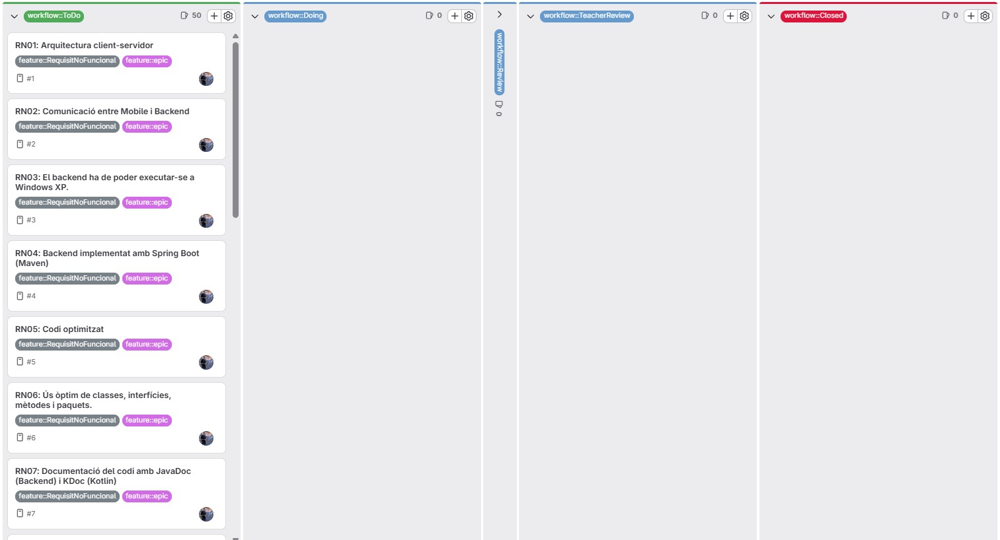
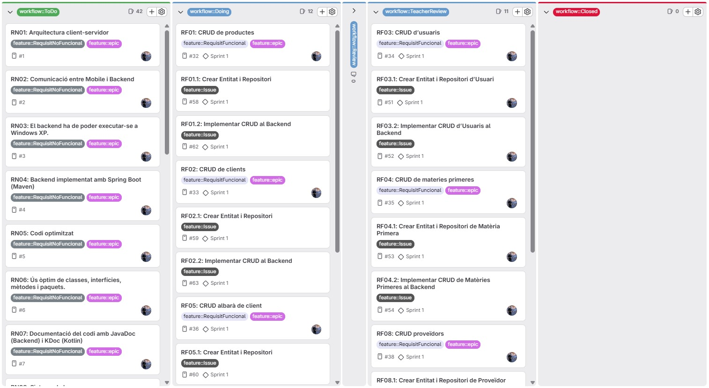
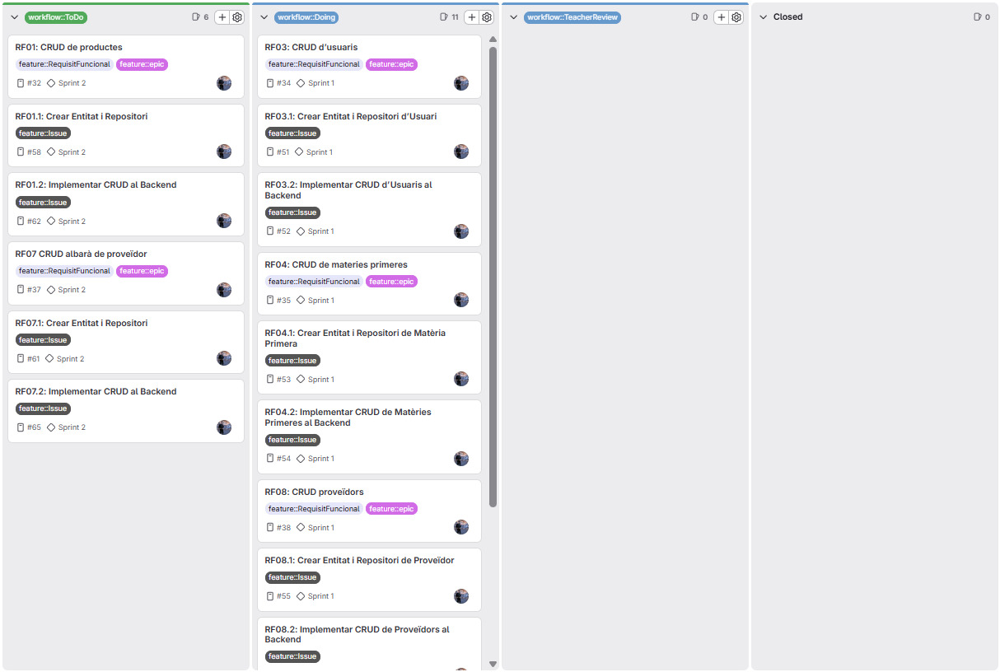
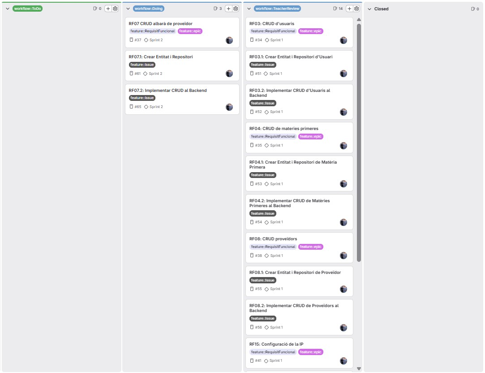
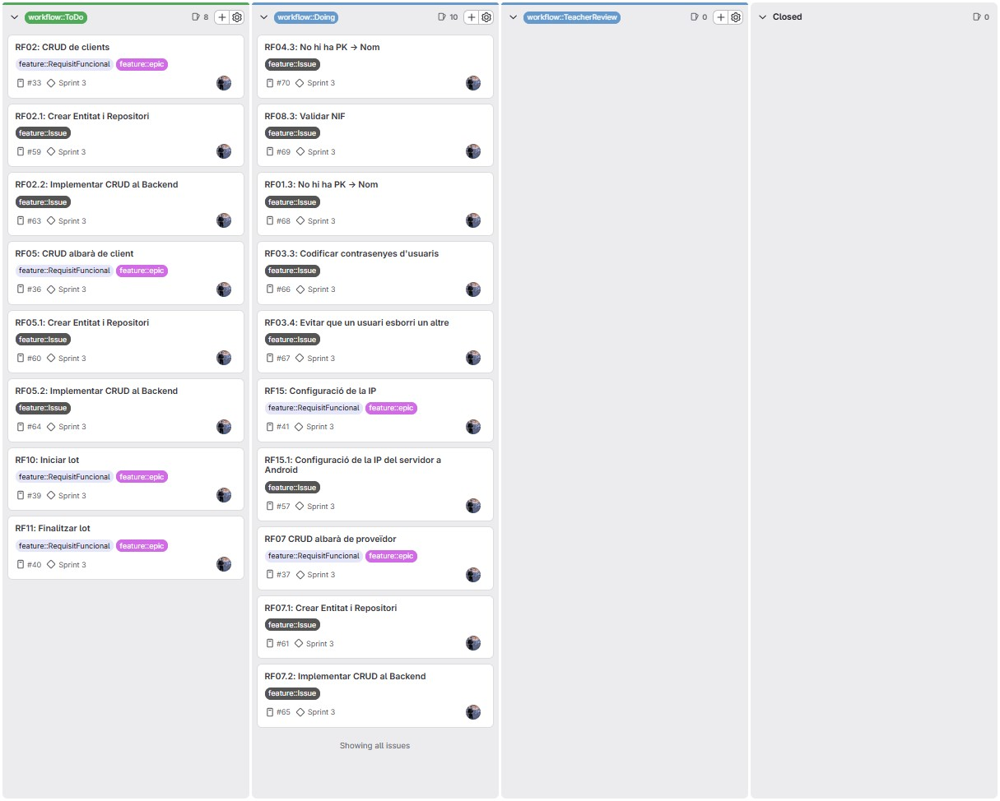
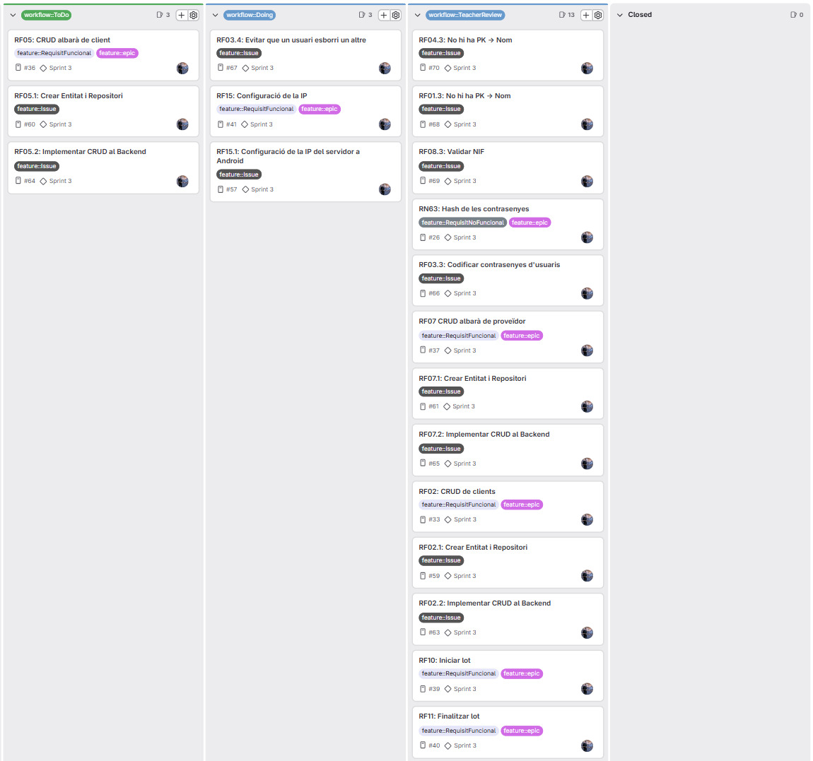
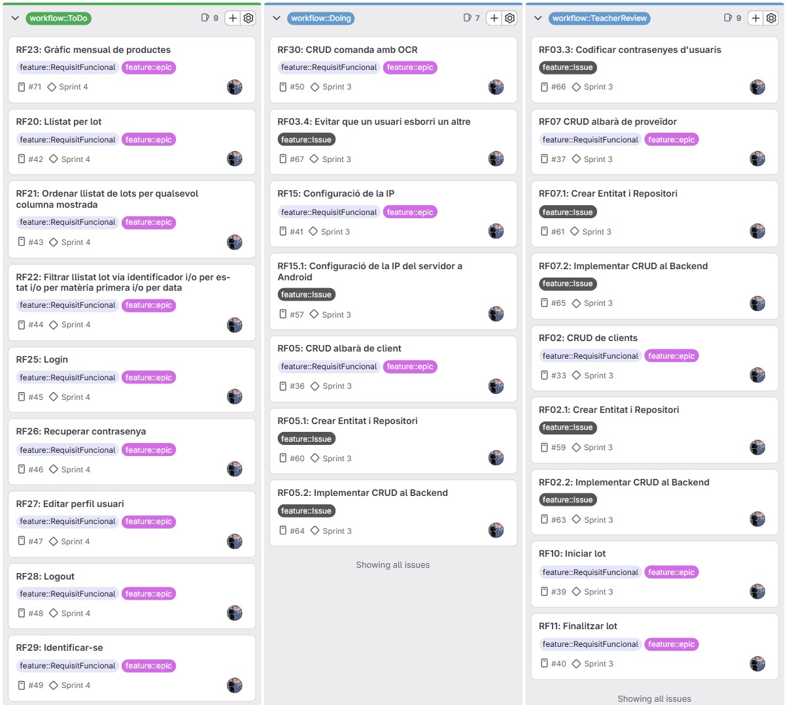
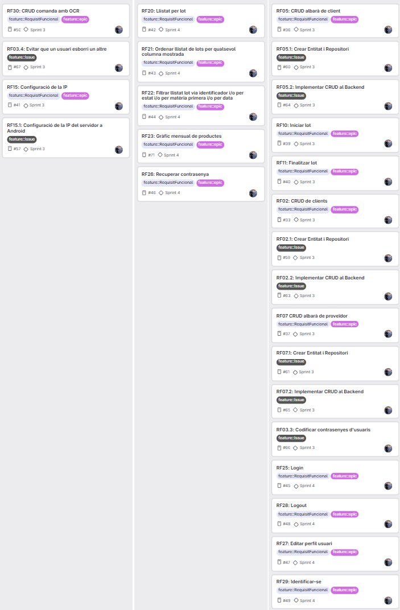
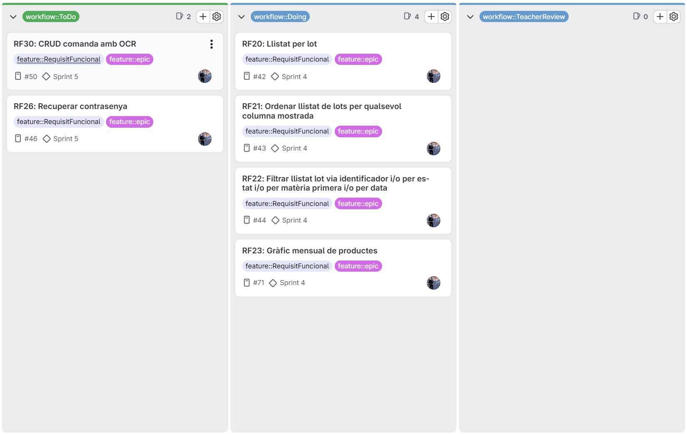
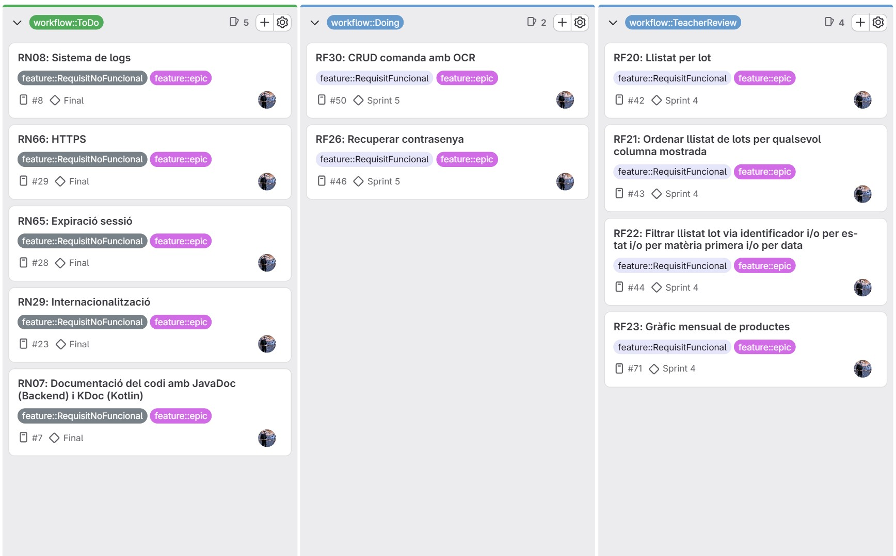

= Memòria Final del Projecte EasyTraza
:toc:
:toclevels: 4

== 1. Planificació i Seguiment de Sprints

=== 1.1 Configuració inicial a GitLab

==== Permisos i accés

El projecte ha estat desenvolupat per un únic integrant, que actua com a líder i desenvolupador.

S'ha afegit l'usuari *dam2m@copernic.cat* amb rol *Maintainer* per a la supervisió del projecte.

==== Creació d'Epics i Issues

S'han creat Epics tant per als Requeriments Funcionals (RF) com per als Requeriments No Funcionals (RNF).

Les Issues no s'han definit totes inicialment, sinó que s'han anat creant de manera progressiva segons les necessitats del desenvolupament.

==== Divisió en Sprints (Milestones)

S'han creat un total de cinc Milestones corresponents als cinc Sprints del projecte.

La seva planificació s'ha realitzat de manera progressiva segons les necessitats del desenvolupament.

==== Estructura del repositori

El repositori s'ha organitzat en tres carpetes principals:

- backend
- mobile
- documentació

=== 1.2 Estats de les tasques (Issue Board)

El seguiment de tasques s'ha realitzat mitjançant un Issue Board personalitzat.

[cols="1,3"]
|===
| Estat | Descripció

| To Do
| Tasques creades i preparades per iniciar-se

| Doing
| Tasques actualment en desenvolupament

| Teacher Review
| Tasques finalitzades pendents de revisió

| Closed
| Tasques completades i tancades
|===

=== 1.3 Seguiment i Documentació dels Sprints

==== Sprint 1

===== Planificació inicial

===== Planificació final

===== Daily Stand Up

====== Divendres 10/04

[cols="1,3"]
|===
| Ahir | -
| Avui | Defensa de la recuperació del projecte 2
| Problemes | No s'ha pogut iniciar el projecte
| Hores | 0h
|===

====== Dilluns 13/04

[cols="1,3"]
|===
| Ahir | -
| Avui | Creació d'epics, labels i estructura del projecte. Configuració inicial de Spring Boot i definició de packages
| Problemes | Error en la creació del projecte Spring Boot
| Hores | 6h
|===

====== Dimarts 14/04

[cols="1,3"]
|===
| Ahir | Configuració inicial del projecte
| Avui | Finalització dels packages
| Problemes | Poc temps disponible
| Hores | 2h
|===

====== Dimecres 15/04

[cols="1,3"]
|===
| Ahir | Estructura de packages finalitzada
| Avui | Inici implementació dels RF
| Problemes | Temps limitat
| Hores | 4h
|===

====== Dijous 16/04

[cols="1,3"]
|===
| Ahir | Inici dels RF
| Avui | Finalització dels RF i documentació
| Problemes | Temps insuficient
| Hores | 6h
|===

===== Retrospective Meeting

====== Aspectes positius

- Estructura del projecte completament definida
- Bona organització del repositori

====== Aspectes a millorar

- Planificació del temps insuficient
- Ritme de treball millorable

====== Accions de millora

- Millorar la planificació inicial
- Anticipar problemes tècnics
- Augmentar dedicació als següents Sprints

==== Sprint 2

===== Planificació inicial

===== Planificació final

===== Daily Stand Up

====== Divendres 17/04

[cols="1,3"]
|===
| Ahir | Finalització dels RF i documentació
| Avui | He creat la branca específica per arreglar tots els errors del sprint 1
| Problemes | Res del que s'ha fet al sprint 1 ha estat correcte, per tant s'ha de refer pràcticament tot
| Hores | 6h
|===

====== Dilluns 20/04

[cols="1,3"]
|===
| Ahir | -
| Avui | Començar a arreglar el CRUD d'usuaris i establir una base en el disseny de tota la part web
| Problemes | És un procés lent
| Hores | 6h
|===

====== Dimarts 21/04

[cols="1,3"]
|===
| Ahir | Inici de la reparació del CRUD i del disseny web
| Avui | Acabar el disseny i reparar tot el que faltava del sprint anterior
| Problemes | Tot i completar-se, ha requerit més temps del previst
| Hores | 8h
|===

====== Dimecres 22/04

[cols="1,3"]
|===
| Ahir | Finalització de la reparació del sprint anterior
| Avui | Inici del sprint 2 amb una base ja funcional
| Problemes | Poc temps disponible després de dedicar molt temps al sprint anterior
| Hores | 4h
|===

====== Dijous 23/04

[cols="1,3"]
|===
| Ahir | Inici del desenvolupament del sprint 2
| Avui | Finalitzar la documentació i deixar preparat el CRUD d'albarà proveïdor
| Problemes | Poc temps disponible, es decideix posposar part de la feina al següent sprint
| Hores | 1h
|===

===== Retrospective Meeting

====== Aspectes positius

- Sprint anterior reparat completament
- L'estructura del projecte s'ha acabat de consolidar i les classes s'utilitzen correctament
- El format visual de la part web està finalitzat i l'aplicació segueix una línia uniforme

====== Aspectes a millorar

- Planificació inicial del temps millorable
- Excés de temps dedicat a corregir errors del sprint anterior
- Distribució de la càrrega de treball poc equilibrada

====== Accions de millora

- Planificar millor les tasques per evitar acumulacions
- Dedicar més temps progressivament durant el sprint

==== Sprint 3

===== Planificació inicial

===== Planificació final

===== Daily Stand Up

====== Divendres 24/04

[cols="1,3"]
|===
| Ahir | Finalització de la documentació del Sprint 2 i preparació del CRUD d'albarà proveïdor
| Avui | Implementació inicial del mòdul d'albarans de proveïdor i la gestió de lots, creant les entitats principals, repositories, serveis i controladors necessaris
| Problemes | -
| Hores | 6h
|===

====== Dilluns 27/04

[cols="1,3"]
|===
| Ahir | Implementació de la base del mòdul d'albarans de proveïdor
| Avui | Continuació del desenvolupament dels albarans de proveïdor i revisió de l'estructura del backend
| Problemes | El desenvolupament del mòdul requereix coordinar diverses entitats relacionades
| Hores | 6h
|===

====== Dimarts 28/04

[cols="1,3"]
|===
| Ahir | Revisió de l'estructura del backend i del sistema d'albarans
| Avui | Continuació del desenvolupament funcional dels albarans de proveïdor i revisió del flux de dades
| Problemes | -
| Hores | 4h
|===

====== Dimecres 29/04

[cols="1,3"]
|===
| Ahir | Continuació del desenvolupament funcional del CRUD d'albarans
| Avui | Correcció d'errors interns del formulari d'albarans i preparació del sistema per futures funcionalitats relacionades amb OCR
| Problemes | El formulari i la relació entre lots i albarans han requerit més ajustos dels esperats
| Hores | 4h
|===

====== Dijous 30/04

[cols="1,3"]
|===
| Ahir | Continuació del desenvolupament i correcció d'errors del sistema d'albarans
| Avui | No s'ha pogut avançar en el projecte per preparació de la selectivitat
| Problemes | Falta de temps disponible
| Hores | 0h
|===

====== Divendres 01/05

[cols="1,3"]
|===
| Ahir | No s'ha pogut avançar en el projecte per preparació de la selectivitat
| Avui | No s'ha treballat en el projecte per continuar preparant la selectivitat
| Problemes | Falta de temps disponible
| Hores | 0h
|===

====== Dilluns 04/05

[cols="1,3"]
|===
| Ahir | -
| Avui | Finalització pràctica de la implementació manual dels albarans de proveïdor
| Problemes | Han aparegut diferents errors llargs de corregir
| Hores | 6h
|===

====== Dimarts 05/05

[cols="1,3"]
|===
| Ahir | Finalització de la implementació manual dels albarans de proveïdor
| Avui | Finalització provisional del formulari d'albarà de proveïdor i inici de la correcció d'errors pendents del Sprint 2
| Problemes | El formulari d'albarà de proveïdor ha requerit molts ajustos
| Hores | 6h
|===

====== Dimecres 06/05

[cols="1,3"]
|===
| Ahir | Revisió del formulari d'albarans i correcció d'errors acumulats
| Avui | Correcció d'errors del Sprint 2 relacionats amb hash de contrasenyes, validacions i verificacions internes
| Problemes | Situació personal que ha reduït considerablement el temps disponible
| Hores | 4h
|===

====== Dijous 07/05

[cols="1,3"]
|===
| Ahir | Finalització de correccions internes i validacions del sistema
| Avui | Implementació dels apartats per iniciar i finalitzar lots i finalització de la documentació del Sprint 3
| Problemes | Problemes personals que han retardat diverses hores l'inici del treball
| Hores | 8h
|===

===== Retrospective Meeting

====== Aspectes positius

- El sistema d'albarans de proveïdor ha quedat pràcticament funcional
- El disseny visual de la part web manté una línia uniforme i coherent
- Les validacions i verificacions internes del sistema han millorat considerablement

====== Aspectes a millorar

- Alguns apartats han requerit molt més temps del previst
- La planificació inicial encara es pot optimitzar
- Falta acabar funcionalitats pendents com OCR

====== Accions de millora

- Dedicar més temps a proves abans de donar una tasca per finalitzada
- Intentar avançar funcionalitats complexes amb més antelació

==== Sprint 4

===== Planificació inicial

===== Planificació final

===== Daily Stand Up

====== Divendres 08/05

[cols="1,3"]
|===
| Ahir | Finalització dels apartats d'inici i finalització de lots i documentació del Sprint 3
| Avui | Estructurar completament el següent sprint i organitzar la feina
| Problemes | La revisió i reorganització han ocupat gran part de les hores disponibles
| Hores | 4h
|===

====== Dilluns 11/05

[cols="1,3"]
|===
| Ahir | Planificació i organització general de les tasques del sprint
| Avui | Implementació completa del CRUD d'albarans de clients
| Problemes | -
| Hores | 6h
|===

====== Dimarts 12/05

[cols="1,3"]
|===
| Ahir | Finalització de la implementació dels albarans de clients
| Avui | Inici de la reparació d'errors del sprint anterior
| Problemes | Dia ocupat per temes personals
| Hores | 4h
|===

====== Dimecres 13/05

[cols="1,3"]
|===
| Ahir | Correcció d'errors dels apartats d'usuaris i clients
| Avui | Finalització de la reparació dels errors pendents del sprint anterior
| Problemes | Molts errors acumulats i poc temps disponible
| Hores | 8h
|===

====== Dijous 14/05

[cols="1,3"]
|===
| Ahir | Finalització de la correcció d'errors acumulats del sprint anterior
| Avui | Finalització del sistema d'autenticació i inici de sessió
| Problemes | Poc temps disponible i gran càrrega de treball
| Hores | 10h
|===

===== Retrospective Meeting

====== Aspectes positius

- El sistema d'autenticació ha quedat complet
- La part mobile ja comença a integrar funcionalitats importants
- El projecte segueix una línia visual coherent

====== Aspectes a millorar

- Alguns apartats han requerit moltes més hores de les previstes
- L'apartat OCR continua pendent

====== Accions de millora

- Continuar millorant la planificació dels sprints

==== Sprint 5

===== Planificació inicial

===== Planificació final

===== Daily Stand Up

====== Divendres 15/05

[cols="1,3"]
|===
| Ahir | Finalització del sistema d'autenticació i documentació del Sprint 4
| Avui | Correcció general del sprint anterior i organització de les tasques del següent sprint
| Problemes | La revisió i reorganització han ocupat pràcticament tot el dia
| Hores | 8h
|===

====== Dissabte 16/05

[cols="1,3"]
|===
| Ahir | Correcció general d'errors i organització de tasques
| Avui | Implementació del bloqueig dels camps que no es poden modificar durant l'edició
| Problemes | -
| Hores | 8h
|===

====== Diumenge 17/05

[cols="1,3"]
|===
| Ahir | Implementació de restriccions en camps d'edició
| Avui | Continuació de la correcció d'errors i implementació de filtres i ordenació
| Problemes | -
| Hores | 10h
|===

====== Dilluns 18/05

[cols="1,3"]
|===
| Ahir | Implementació de filtres i ordenació en diferents apartats
| Avui | Finalització de la correcció dels errors del Sprint 4 i inici de l'apartat d'explotació de dades
| Problemes | -
| Hores | 10h
|===

====== Dimarts 19/05

[cols="1,3"]
|===
| Ahir | Inici de l'apartat d'explotació de dades
| Avui | Finalització de l'apartat d'explotació de dades i inici de la gestió de lots a mobile
| Problemes | -
| Hores | 11h
|===

====== Dimecres 20/05

[cols="1,3"]
|===
| Ahir | Implementació inicial de la gestió de lots a mobile
| Avui | Finalització de la gestió de lots a mobile i revisió del funcionament
| Problemes | Alguns errors menors durant les proves
| Hores | 10h
|===

====== Dijous 21/05

[cols="1,3"]
|===
| Ahir | Finalització de la gestió de lots a mobile
| Avui | Reinici de la implementació de l'apartat OCR
| Problemes | Funcionalitat molt complexa que ha requerit diverses revisions
| Hores | 12h
|===

===== Retrospective Meeting

====== Aspectes positius

- La gestió de lots a mobile ha quedat funcional
- Les eines de filtratge i ordenació milloren l'experiència d'usuari
- L'explotació de dades ha quedat implementada

====== Aspectes a millorar

- L'apartat OCR continua requerint molt més temps del previst
- Alguns errors han obligat a repetir parts de la implementació

====== Accions de millora

- Millorar la integració final entre backend i mobile
- Acabar d'estabilitzar els apartats més crítics del projecte

== 2. Documentació Tècnica

=== Decisions de disseny i implementació

==== Arquitectura general del projecte

S'ha optat per una arquitectura client-servidor basada en una API REST. El backend s'ha desenvolupat amb Spring Boot seguint una estructura en capes, separant controladors, serveis, repositoris i entitats. Aquesta organització facilita el manteniment del projecte i permet separar la lògica de negoci de la persistència i de la presentació de dades.

La persistència s'ha implementat amb JPA i MySQL. La interfície web utilitza Thymeleaf, HTML, CSS i JavaScript, mentre que el client Mobile s'ha desenvolupat amb Kotlin i Jetpack Compose.

La comunicació entre Mobile i Backend es realitza mitjançant peticions REST utilitzant Retrofit.

==== Organització del client Mobile

L'aplicació Mobile s'ha estructurat per funcionalitats, separant els apartats d'autenticació, lots i configuració. En les funcionalitats principals s'han diferenciat les capes de dades, domini i presentació.

Per gestionar l'estat de les pantalles s'han utilitzat ViewModels i fluxos d'estat reactius, especialment en la identificació d'usuaris i en la gestió de lots.

==== Uniformitat visual i experiència d'usuari

La interfície web manté una línia visual comuna entre els diferents apartats de gestió. S'ha aplicat un mateix estil general a les pantalles treballades, mantenint coherència en formularis, llistats, accions i elements de navegació.

A Mobile també s'han reutilitzat components visuals i un tema comú per mantenir coherència entre les pantalles d'identificació, configuració, menú principal i gestió de lots.

==== Gestió d'albarans i procés OCR

L'entrada d'albarans de proveïdor s'ha implementat des de la part web, permetent la gestió manual de les dades i la lectura automàtica mitjançant OCR.

La funcionalitat OCR ha estat un dels apartats més complexos del projecte i ha requerit diverses revisions durant el desenvolupament. Finalment, s'ha integrat al backend i a la interfície web, incorporant avisos i missatges d'error adaptats a l'idioma seleccionat per l'usuari.

==== Autenticació, sessions i protecció de dades

La interfície web disposa d'un sistema d'autenticació mitjançant correu electrònic i contrasenya. Les contrasenyes s'emmagatzemen de forma segura utilitzant hash BCrypt.

També s'ha implementat el tancament de sessió, l'edició del perfil de l'usuari i la recuperació de contrasenya en cas d'oblit.

L'accés als apartats administratius de la interfície web està restringit segons el rol de l'usuari. Els operaris no poden accedir als apartats exclusius d'administració.

La sessió web caduca després d'un període d'inactivitat i la cookie de sessió està protegida en el context HTTPS.

Per evitar accessos no autoritzats, els documents ubicats a la carpeta d'uploads no són accessibles públicament sense autenticació. A Mobile, el procés d'identificació retorna únicament les dades mínimes necessàries per seleccionar l'usuari i mantenir la sessió funcional, evitant exposar dades personals innecessàries.

==== HTTPS i comunicació amb el servidor

La navegació de la interfície web funciona mitjançant HTTPS utilitzant un certificat TLS autosignat.

Per a la connexió de Mobile s'ha mantingut la configuració HTTP actual del projecte, permetent introduir únicament l'adreça IPv4 del servidor i construint internament la URL necessària per realitzar les peticions.

==== Internacionalització

La interfície web i l'aplicació Mobile estan disponibles en català i castellà. El català s'ha establert com a idioma base del projecte.

A la part web s'ha incorporat un selector d'idioma i a Mobile s'ha afegit la selecció d'idioma amb persistència local. També s'han internacionalitzat els missatges visibles necessaris, incloent els errors mostrats durant el procés OCR.

==== Sistema de logs

El backend incorpora un sistema de logs en fitxers per registrar errors, excepcions i avisos relacionats amb el funcionament de l'aplicació.

Els logs es generen dins de la carpeta corresponent del backend i disposen d'un sistema de rotació per limitar la mida i el nombre de fitxers generats, facilitant així el manteniment de l'aplicació.

==== Documentació del codi

El backend Java incorpora documentació JavaDoc a les classes i mètodes treballats. El client Mobile incorpora documentació KDoc a les classes i funcions Kotlin.

Aquesta documentació permet entendre millor la responsabilitat de cada classe i el funcionament dels principals mètodes del projecte.

=== Requeriments implementats

Durant el desenvolupament del projecte s'han implementat les principals funcionalitats definides als requeriments funcionals i no funcionals de l'enunciat.

==== Gestió de dades principals

- RF01: CRUD de productes.
- RF02: CRUD de clients.
- RF03: CRUD d'usuaris.
- RF04: CRUD de matèries primeres.
- RF08: CRUD de proveïdors.

==== Gestió d'albarans i lots

- RF05: CRUD d'albarans de client amb línies de producció.
- RF07: CRUD d'albarans de proveïdor amb línies de lots i suport OCR des de la part web.
- RF10: Iniciar lots.
- RF11: Finalitzar lots.
- RF20: Llistat de producció associada a un lot.
- RF21: Ordenació del llistat de lots.
- RF22: Filtrat del llistat de lots per identificador, estat, matèria primera i data.

==== Explotació de dades

- RF23: Gràfic mensual de productes venuts.
- Visualització de dades agregades segons els filtres disponibles.
- Implementació de filtres i ordenacions necessàries als llistats treballats.

==== Autenticació, perfil i seguretat

- RF25: Login d'usuaris a la interfície web.
- RF26: Recuperació de contrasenya en cas d'oblit.
- RF27: Edició del perfil d'usuari.
- RF28: Logout.
- RF29: Identificació d'usuari a Mobile sense contrasenya.
- RN61: Sistema d'autenticació web mitjançant usuari i contrasenya.
- RN62: Control d'accés a rutes protegides i restricció d'accés directe als documents d'uploads.
- RN63: Emmagatzematge segur de contrasenyes mitjançant hash BCrypt.
- RN64: Protecció de dades personals, reduint les dades retornades durant la identificació Mobile.
- RN65: Caducitat segura de les sessions web.
- RN66: Comunicació HTTPS per a la interfície web mitjançant certificat TLS autosignat.
- RN67: Identificació d'usuaris des del client Mobile.

==== Mobile i configuració

- RF15: Configuració persistent de l'adreça IPv4 del servidor a Android.
- RN20: Aplicació Mobile desenvolupada amb Android Studio, Kotlin i Jetpack Compose.
- RN21: Organització de les funcionalitats principals seguint Feature Layer i separació per capes.
- RN22: Aplicació del patró MVVM i gestió d'estat a la capa de presentació.
- RN23: Desenvolupament orientat a dispositius Android.
- Gestió de lots des de Mobile, amb llistat, detall, inici i finalització de lots.

==== Qualitat, interfície i experiència d'usuari

- RN07: Documentació del codi mitjançant JavaDoc al backend i KDoc a Mobile.
- RN08: Sistema de logs del backend en fitxers amb rotació.
- RN09: Gestió d'errors i missatges visibles en l'idioma seleccionat, incloent els errors del procés OCR.
- RN25: Interfície visual coherent a Web i Mobile.
- RN26: Navegació clara i restricció visual de funcionalitats segons el rol de l'usuari.
- RN27: Operacions remotes de Mobile executades sense bloquejar la interfície.
- RN28: Adaptació de les pantalles a la mida disponible.
- RN29: Internacionalització en català i castellà a Web i Mobile.

=== Requeriments no implementats o fora de l'abast final

- RF30: CRUD de comandes. No s'ha implementat perquè es tracta d'una funcionalitat opcional segons l'enunciat.
- Gestió d'albarans des de Mobile. No es presenta com una funcionalitat final implementada, ja que l'entrada i el tractament OCR dels albarans s'han desenvolupat a la part web/backend.

=== Incidències

Durant el desenvolupament del projecte han aparegut diverses incidències tècniques i organitzatives que han afectat parcialment la planificació inicial.

- Diversos apartats han requerit més temps del previst per la seva complexitat.
- Alguns formularis i relacions entre entitats han necessitat múltiples revisions.
- La integració entre backend, web i Mobile ha requerit ajustos constants.
- Han aparegut errors acumulats entre diferents sprints que han obligat a dedicar temps extra a estabilització.
- El desenvolupament del sistema OCR ha requerit replantejar part de la implementació inicial.
- S'han detectat problemes puntuals relacionats amb validacions, autenticació, control d'accés i protecció de dades.
- Ha estat necessari revisar l'accés als documents pujats per evitar que es poguessin consultar sense autenticació.
- La càrrega de treball ha estat elevada durant diversos períodes del projecte.
- Algunes funcionalitats Mobile han necessitat diverses proves abans de funcionar correctament.
- Determinades funcionalitats han necessitat proves addicionals per garantir estabilitat.

=== Desviacions

La planificació inicial del projecte ha sofert algunes desviacions durant el desenvolupament real de l'aplicació.

- Gran part del temps s'ha destinat a estabilitzar funcionalitats ja implementades.
- Diverses funcionalitats han requerit més hores de desenvolupament de les previstes inicialment.
- Alguns apartats s'han reorganitzat entre sprints per prioritzar funcionalitats més importants.
- La implementació OCR ha requerit una revisió completa de l'enfocament inicial.
- El desenvolupament Mobile ha necessitat ajustos addicionals per integrar-se correctament amb el backend.
- Part del temps planificat per a noves funcionalitats s'ha utilitzat per corregir errors interns.
- Algunes funcionalitats s'han implementat de forma progressiva per garantir estabilitat.
- S'han prioritzat funcionalitats crítiques abans que millores secundàries.
- La revisió i reorganització dels sprints ha ocupat més temps del previst en alguns períodes.
- La gestió d'albarans des de Mobile no s'ha inclòs dins de l'abast final implementat.

== 3. Propostes de Millora

El projecte cobreix les funcionalitats principals definides dins de l'abast final implementat. Tot i això, existeixen diverses millores i ampliacions que es podrien incorporar en futures versions.

- Desenvolupar la gestió d'albarans de proveïdor des del client Mobile.
- Implementar RF30, gestió de comandes, tot i que es tracta d'una funcionalitat opcional.
- Continuar millorant el sistema OCR per augmentar la precisió de lectura.
- Afegir més estadístiques i gràfics avançats d'explotació de dades.
- Millorar encara més l'experiència d'usuari de la part Mobile.
- Implementar notificacions internes dins l'aplicació.
- Afegir exportació de dades en PDF o Excel.
- Incorporar més validacions automàtiques al backend.
- Millorar el rendiment general en llistats amb moltes dades.
- Afegir un sistema de còpies de seguretat automàtiques.
- Incorporar proves automatitzades per facilitar el manteniment futur.

== 4. Conclusió

Durant el desenvolupament del projecte EasyTraza s'ha treballat en la creació d'una aplicació orientada a la gestió de traçabilitat de lots, productes, clients, proveïdors i albarans, combinant una interfície web de gestió amb un client Mobile destinat a les operacions principals de l'operari.

Al llarg dels diferents sprints s'han implementat les funcionalitats principals definides dins de l'abast final del projecte, millorant progressivament l'estructura interna, l'organització del codi i l'estabilitat general de l'aplicació.

El projecte ha permès desenvolupar la gestió de dades principals, els albarans de client i proveïdor, la traçabilitat dels lots, l'explotació de dades, el sistema d'autenticació, l'edició de perfil, la recuperació de contrasenya, la identificació Mobile i la gestió de lots des del dispositiu mòbil.

També s'han incorporat aspectes no funcionals importants, com la internacionalització en català i castellà, el registre de logs, la documentació JavaDoc i KDoc, la caducitat de sessions, l'accés HTTPS a la interfície web i les mesures necessàries per evitar accessos no autoritzats o exposició innecessària de dades personals.

Un dels apartats més exigents ha estat la integració del procés OCR per a la lectura d'albarans de proveïdor, ja que ha requerit diverses revisions i una dedicació superior a la planificada inicialment. També ha estat necessari dedicar temps a estabilitzar funcionalitats ja implementades i corregir incidències detectades durant les proves.

Aquest projecte ha servit per aprofundir en tecnologies i conceptes com Spring Boot, JPA, MySQL, Thymeleaf, Kotlin, Jetpack Compose, APIs REST, arquitectures en capes, MVVM, autenticació, seguretat, internacionalització, OCR i organització de projectes amb GitLab.

A més del desenvolupament tècnic, el projecte ha permès millorar aspectes relacionats amb la planificació, la resolució d'incidències, l'organització de tasques, el control de versions i la capacitat d'adaptació davant problemes reals durant el desenvolupament d'una aplicació completa.