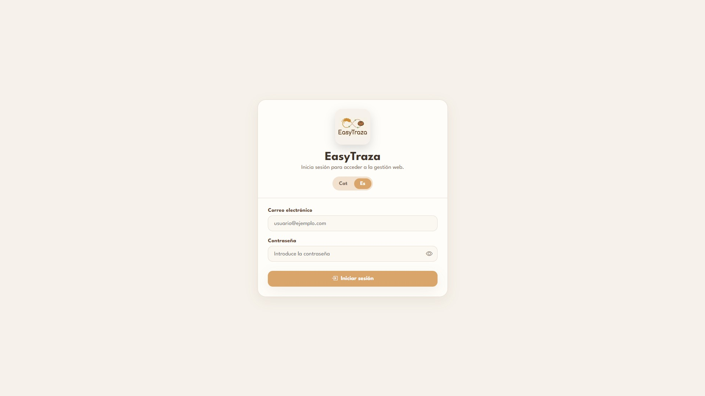
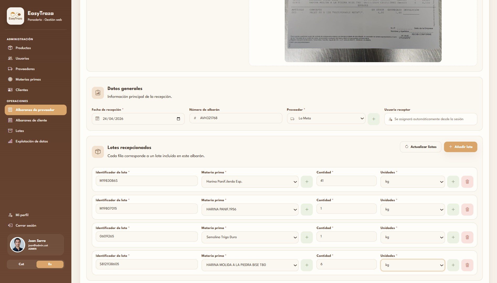
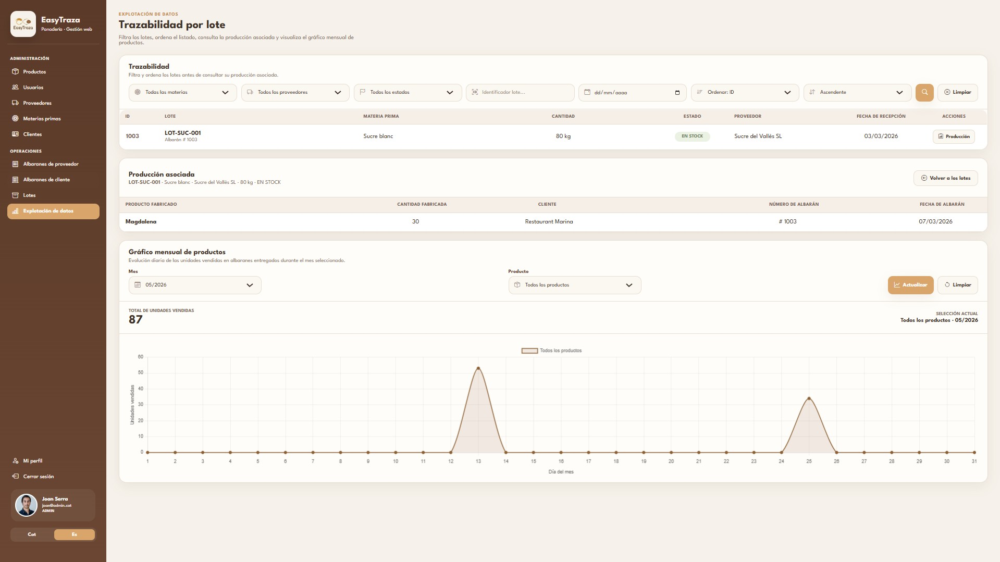
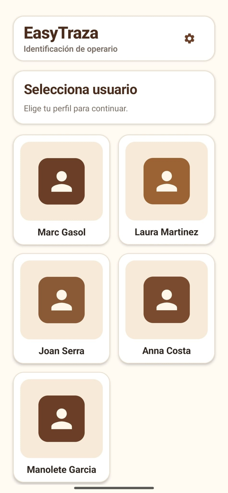
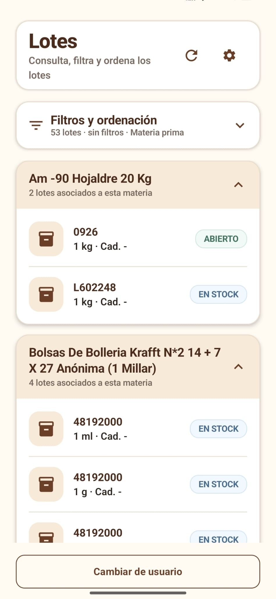

= EasyTraza
Ángel Jurado Herruzo - DAM2 - Institut Nicolau Copèrnic
:toc:
:toclevels: 2

== Descripció del projecte

*EasyTraza* és una aplicació de gestió i traçabilitat orientada a entorns de producció alimentària. El projecte permet controlar les matèries primeres rebudes, els lots utilitzats durant la producció, els albarans de proveïdor i client, els productes finals i la traçabilitat de cada procés.

L'aplicació està formada per una interfície web destinada a la gestió administrativa i operativa del sistema, i una aplicació Mobile orientada a la identificació de l'operari i a la gestió de lots durant el procés de producció.

El projecte s'ha desenvolupat seguint una arquitectura client-servidor, amb un backend Spring Boot, una interfície web Thymeleaf i una aplicació Android desenvolupada amb Kotlin i Jetpack Compose.

== Vídeo promocional / Demo

El projecte disposa d'un vídeo promocional en català on es presenta l'aplicació i es mostren les funcionalitats principals implementades.

* link:https://www.youtube.com/watch?v=y_jSd-ZaW2U[Veure vídeo promocional d'EasyTraza]

== Tecnologies utilitzades

[cols="1,3", options="header"]
|===
| Àmbit | Tecnologies

| Backend
| Java, Spring Boot, Maven, Spring MVC, Spring Security i Spring Data JPA

| Frontend web
| HTML, CSS, JavaScript i Thymeleaf

| Mobile
| Kotlin, Android Studio, Jetpack Compose i Retrofit

| Persistència
| MySQL i JPA

| Seguretat
| BCrypt, control d'accés per rols, sessions web i HTTPS amb certificat TLS

| Documentació i gestió
| AsciiDoc, Git i GitLab
|===

== Funcionalitats principals

=== Gestió administrativa Web

Des de la interfície web es poden gestionar els elements principals de l'aplicació:

- Productes.
- Usuaris.
- Proveïdors.
- Matèries primeres.
- Clients.
- Albarans de proveïdor.
- Albarans de client.
- Lots.
- Perfil de l'usuari autenticat.

=== Albarans de proveïdor i OCR

EasyTraza permet registrar albarans de proveïdor amb les seves línies de lots i matèries primeres.

A més, s'ha incorporat un sistema OCR que permet llegir documents d'albarans i facilitar la introducció de dades a l'aplicació. El sistema mostra els resultats detectats perquè puguin ser revisats abans del guardat definitiu.

=== Gestió i traçabilitat de lots

El sistema permet:

- Registrar lots de matèries primeres.
- Iniciar un lot durant el procés de producció.
- Finalitzar un lot quan deixa d'utilitzar-se.
- Consultar la producció associada a un lot determinat.
- Filtrar i ordenar els lots segons diferents criteris.

Aquesta funcionalitat facilita la traçabilitat de la matèria primera des de la seva recepció fins als productes lliurats als clients.

=== Explotació de dades

L'aplicació incorpora un apartat d'explotació de dades que permet visualitzar l'evolució mensual dels productes venuts mitjançant un gràfic.

El gràfic permet consultar:

- Les unitats venudes durant un mes concret.
- El total mensual de productes.
- La informació filtrada segons el producte seleccionat.

=== Autenticació i perfil d'usuari

La interfície web disposa de:

- Inici de sessió mitjançant correu electrònic i contrasenya.
- Tancament de sessió.
- Edició del perfil de l'usuari.
- Recuperació de contrasenya en cas d'oblit.
- Restricció d'accés als apartats administratius segons el rol de l'usuari.

Les contrasenyes s'emmagatzemen de forma segura mitjançant BCrypt.

=== Seguretat i manteniment

S'han incorporat diferents mesures per protegir i mantenir l'aplicació:

- Navegació web mitjançant HTTPS amb certificat TLS autosignat.
- Caducitat segura de la sessió web després d'un període d'inactivitat.
- Protecció d'accés als documents interns.
- Limitació de dades personals retornades en la identificació Mobile.
- Sistema de logs en fitxers amb rotació per registrar errors, excepcions i avisos.

=== Internacionalització

La interfície Web i l'aplicació Mobile estan disponibles en:

- Català.
- Castellà.

El català és l'idioma base de l'aplicació. L'usuari pot seleccionar l'idioma des de la interfície corresponent, i a Mobile la selecció es conserva localment.

=== Aplicació Mobile

L'aplicació Mobile permet a l'operari:

- Configurar l'adreça IPv4 del servidor.
- Seleccionar l'idioma de l'aplicació.
- Identificar-se sense contrasenya.
- Consultar el llistat de lots.
- Consultar el detall d'un lot.
- Iniciar un lot.
- Finalitzar un lot.

== Captures de la interfície

=== Interfície Web

==== Inici de sessió

==== Gestió d'albarans de proveïdor i OCR

==== Explotació de dades

=== Aplicació Mobile

==== Identificació de l'operari

==== Gestió de lots

== Estructura del repositori

El repositori del projecte està organitzat en les carpetes principals següents:

[source,text]
----
EasyTraza/
├── Backend/          Projecte Spring Boot i interfície web Thymeleaf
├── Mobile/           Aplicació Android desenvolupada amb Kotlin i Jetpack Compose
├── Documentacio/     Memòria del projecte, captures i documents associats
└── README.adoc       Presentació general del projecte
----

== Execució del projecte

=== Backend i interfície Web

Per executar el backend és necessari tenir configurada la base de dades MySQL i iniciar el projecte Spring Boot.

[source,bash]
----
cd backend
mvn spring-boot:run
----

La interfície web queda disponible mitjançant HTTPS al port configurat per l'aplicació.

[source,text]
----
https://localhost:8443
----

=== Aplicació Mobile

L'aplicació Mobile s'executa des d'Android Studio sobre un emulador o dispositiu Android.

Abans d'utilitzar les funcionalitats connectades amb el backend, cal configurar des de l'aplicació l'adreça IPv4 de l'equip on s'està executant el servidor.

== Documentació del projecte

La memòria completa del projecte es troba dins de la carpeta `Documentacio`:

* link:Documentacio/memoria_final.adoc[Memòria Final del Projecte EasyTraza]

La documentació inclou:

- Planificació i seguiment dels cinc sprints.
- Captures inicials i finals dels Issue Boards.
- Daily Stand Up i retrospectives.
- Decisions de disseny i implementació.
- Requeriments implementats.
- Incidències i desviacions.
- Propostes de millora.
- Conclusió final del projecte.

== Autor

*Ángel Jurado Herruzo*  
Desenvolupament d'Aplicacions Multiplataforma - DAM2  
Institut Nicolau Copèrnic